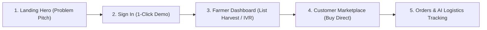

# Kissan Connect — Complete Demo & Presentation Guide

> **SIH Problem Statement ID:** 26033  
> **Theme:** Agriculture, FoodTech & Rural Development (DoCA)  
> **Live App:** `http://localhost:3000`

---

## 🚀 Overview of Completed Frontend Features

All **5 pending frontend steps** from [PROJECT_CONTEXT.md](file:///Users/nameadd/NOVUS/kissan-connect/PROJECT_CONTEXT.md#L149-L155) have been built, connected to the live mock API, and verified:

1. ✅ **Connected Sign In Form** (`/signin` → `POST /api/auth/login` with 1-click role presets & session routing)
2. ✅ **Connected Join / Registration Form** (`/join` → `POST /api/auth/register` with role cards & direct onboarding)
3. ✅ **Farmer Dashboard** (`/farmer` with real-time produce listings, +List Modal, status management, voice IVR simulator, and orders tracker)
4. ✅ **Customer Marketplace** (`/marketplace` with live search, retail savings benchmark, instant order checkout modal to `POST /api/orders`, and My Orders live tracking)
5. ✅ **Universal Responsive Navbar with Mobile Hamburger Menu** (integrated across all pages with user session state)

---

## 🎬 Step-by-Step Live Demo Script for Judges / Presentation

---

### Step 1: Pitch the Vision on the Landing Page
- **URL**: [http://localhost:3000](http://localhost:3000)
- **What to show**:
  1. Show the main Hero: *"Eliminating the Middleman. Empowering the Farmer."*
  2. Highlight the **SIH Problem Statement 26033** badge.
  3. Show the interactive Bento preview cards linking to **How It Works**, **AI Logistics**, and **Our Impact**.
  4. **Speaker talking point:**  
     > *"Traditional agricultural supply chains have 4 to 6 intermediaries, taking up to 50% of the price. Kissan Connect establishes a direct link between village producer clusters and consumers/bulk buyers using AI routing and regional collection HUBs."*

---

### Step 2: Seamless Role-Based Authentication
- **URL**: [http://localhost:3000/signin](http://localhost:3000/signin)
- **What to show**:
  1. Click **"Sign In"** in the top navigation.
  2. Notice the **1-Click Demo Role Switcher** at the top (`Farmer`, `Customer`, `Logistics`).
  3. Click **"Farmer"** — it auto-fills `ravi@farm.in`.
  4. Click **"Sign in as Farmer"** → Watch it authenticate via `POST /api/auth/login` and automatically transition into the **Farmer Dashboard** (`/farmer`).

---

### Step 3: Farmer Dashboard & Voice IVR Demo
- **URL**: [http://localhost:3000/farmer](http://localhost:3000/farmer)
- **What to show**:
  1. **Live Metrics**: Point out the *Available Stock (kg)*, *Active Listings*, *Est. Crop Value (₹)*, and *Orders Received*.
  2. **AI Market Intelligence Feed**: Shows real-time DoCA price forecasts (e.g. Tomatoes +14% demand in Pune/Mumbai).
  3. **Add Produce (Live CRUD)**:
     - Click **"+ List Produce"** button.
     - Enter produce name (e.g., *"Organic Bell Peppers"*), Quantity (*150 kg*), and Price (*₹40/kg*).
     - Click **"Publish to Marketplace"** → The new crop instantly appears in the table and syncs across the platform!
  4. **Offline Accessibility Innovation (Toll-Free IVR)**:
     - Click the **"Simulate Toll-Free IVR"** button (with phone icon).
     - Show the toast notification demonstrating how farmers without smartphones call `1800-KISSAN` to list crops via voice!
  5. **Status Management**: Show the dropdown to change a crop status between `Available`, `Reserved`, and `Sold`.

---

### Step 4: Customer Direct Marketplace & Instant Order
- **URL**: [http://localhost:3000/marketplace](http://localhost:3000/marketplace)
- **What to show**:
  1. Click **"Marketplace"** in the navigation bar.
  2. **Produce Discovery**:
     - Search for produce using the search bar (e.g., type *"Tomatoes"* or click a quick tag like *"Nashik HUB"*).
     - Point out the **"Save 35% vs Retail"** benchmark badge on each card.
  3. **Place a Direct Order**:
     - Click **"Buy Direct from Farmer"** on any produce card.
     - Adjust the quantity using the `+` / `-` buttons (e.g. *10 kg*).
     - Point out the live breakdown showing ₹0 middleman fees.
     - Click **"Confirm & Buy"** → Watch the animated **"Order Confirmed!"** receipt appear.
  4. Click **"Track in My Orders"** → View the placed order with real-time status (`pending` / `in_transit`).

---

### Step 5: AI Logistics & Ecosystem Impact
- **URL**: [http://localhost:3000/ai-logistics](http://localhost:3000/ai-logistics) & [http://localhost:3000/impact](http://localhost:3000/impact)
- **What to show**:
  1. Navigate to **AI Logistics**: Show the HUB-and-spoke dynamic routing visualization where electric multi-stop trucks aggregate rural harvests.
  2. Navigate to **Our Impact**: Show the validated outcome metrics:
     - **+40%** Farmer take-home earnings
     - **-20%** Consumer grocery prices
     - **-35%** Post-harvest food spoilage reduction

---

### Step 6: Mobile Responsiveness Check (Hamburger Menu)
- **How to test**:
  1. In Chrome/browser DevTools, toggle device mode (e.g. iPhone 14 / Pixel 7).
  2. Click the hamburger menu icon (☰) in the top right.
  3. Show the slide-down mobile menu with authenticated user profile badge, direct navigation links, and Sign Out action.

---

## 🛠️ Verification & Build Status

- **TypeScript Compilation:** `0 Errors`
- **Next.js Production Build:** `Compiled successfully (18/18 routes)`
- **Dev Server:** Running at `http://localhost:3000`
